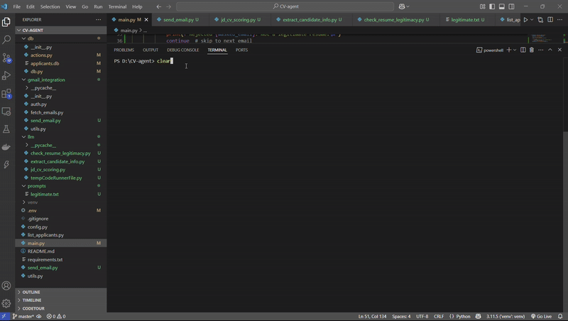

# 📄 CV-Agent: Automating Resume Screening with LLMs + Gmail Integration

Welcome to **CV-Agent**, an intelligent system designed to automate the collection, verification, evaluation, and communication with job applicants — using the power of **Gmail API**, **OpenAI/LLMs**, and **SQLite**!

---

## 🚀 Features

- 🔎 **Fetch Unread Emails**: Automatically retrieves unread emails containing resumes from a Gmail account.
- 🧹 **Resume Legitimacy Check**: Uses LLMs to detect whether a received document is a valid resume.
- 🎯 **JD-CV Matching Score**: Compares the resume against a pre-defined **Job Description** to calculate a **matching score**.
- 🧠 **Candidate Information Extraction**: Extracts:
  - Full Name
  - Work Experience Summary
  - Education Summary
  - Key Skills
  - Relevant Keywords
- 🛡️ **Email Privacy Protection**: Masks candidate email addresses using **SHA-256 hashing** before storing them.
- 🗃️ **Database Integration**: Saves applicant information in a local **SQLite database** with:
  - Masked Email
  - Original Email
  - JD-CV Matching Score
  - Extracted Candidate Info
- 📩 **Automatic Reply to Candidates**: Sends a personalized email back to each applicant with a summary of their extracted details.

---
## Demo




---

## 📚 Tech Stack

- **Python 3.10+**
- **Gmail API** (OAuth 2.0 Authentication)
- **OpenRouter/OpenAI API** (for LLM-powered evaluations)
- **SQLite** (Database)
- **dotenv** (Environment Variables Management)

---

## 🛠 Project Structure

```bash
CV-agent/
│
├── gmail_integration/
│   ├── auth.py              # Authenticate with Gmail API
│   ├── fetch_emails.py       # Fetch unread emails
│   └── send_email.py         # Send replies to candidates
│
├── db/
│   ├── db.py                 # SQLite Database setup
│   └── actions.py            # Save and retrieve from DB
│
├── llm/
│   ├── check_resume_legitimacy.py   # Check if a document is a valid resume
│   ├── jd_cv_scoring.py              # Score resume vs job description
│   └── extract_candidate_info.py    # Extract key candidate details
│
├── .env                    # API keys and secrets
├── main.py                 # Main orchestration file
└── README.md               # You are here! 📖
```

## 🛠 Installation & Setup
### 1. Clone the Repository
```
git clone https://github.com/your-username/cv-agent.git
cd cv-agent
```
### 2. Create and Activate a Virtual Environment
```
# On Windows
python -m venv venv
venv\Scripts\activate
```
### 3. Install Required Packages
```
pip install -r requirements.txt
```
### 4. Set up Gmail API Credentials

Go to Google Cloud Console.

Create a new project and enable Gmail API.

Set up OAuth 2.0 credentials.

Download the credentials.json file.

Create a folder named credentials/ in the project root.

Move credentials.json into the credentials/ folder.

```
mkdir credentials
# Then place credentials.json inside this folder
```
### 5. Set Up Environment Variables
Create a .env file in the root directory with the following content:

```
OPENROUTER_API_KEY=your_openrouter_api_key_here
```
### 6. Run the Project
```
python main.py
```
## 📊 Bonus Tip: View the Database Using DB Browser
Install DB Browser for SQLite.

Open the db/applicants.db file.

Browse, view, and edit your applicants' database easily.

